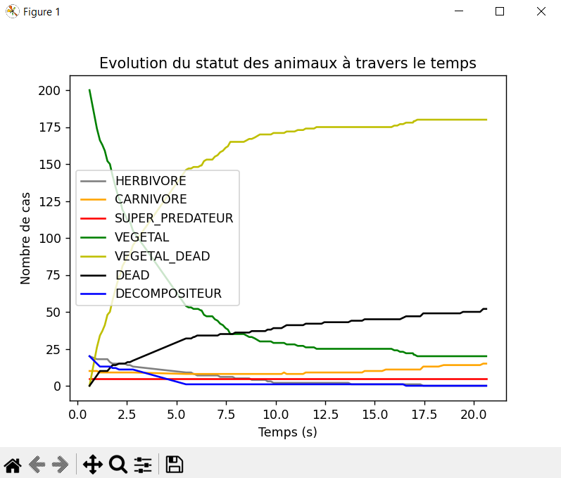

# Julien GODEST TP

### Couleurs
- Rouge : Super Predateur (rapide)
- Orange : Carnivore
- Gris : Herbivore
- Bleue : Decomposeur (très lent)
- Vert : Vegetal (rayon plus petit)

### Touche Clavier
- Taper sur la touche " r " pour afficher dans le terminal (console) les statistiques et les individus ayant la meilleur génétique

## Fin Projet en Image

### Carte de l'environnement

####
### Statistiques dans la console

####
### Graphique de l'évolution du statut des espèces 



## Fonctionnalités

- [x] Attributs pour chaque body (vitesse, faim, reproduction)
```python
 def __init__(self, parent, statut, position, vmin, vmax, accmin, accmax, faim_min, faim_max, fatigue_min, fatigue_max,reproduction_min, reproduction_max, endormi_min, endormi_max, esperance_min, esperance_max):
        self.position = position
        self.vitesse = Vector2(random.uniform(-10, 10), random.uniform(-10, 10))
        self.vMax = random.randint(vmin, vmax)
        self.accMax = random.randint(accmin, accmax)
        self.mass = 10
        self.color = 1, 128, 1
        self.fustrum = Fustrum(10, self)
        self.acc = Vector2()
        self.parent = parent
        self.timer_faim = pygame.time.get_ticks()
        self.jauge_faim_max = random.randint(faim_min, faim_max)
        self.timer_fatigue = pygame.time.get_ticks()
        self.jauge_fatigue_max = random.randint(fatigue_min, fatigue_max)
        self.timer_endormi = 0
        self.jauge_endormi_max = random.randint(endormi_min, endormi_max)
        self.timer_reproduction = pygame.time.get_ticks()
        self.jauge_reproduction_max = random.randint(reproduction_min, reproduction_max)
        self.esperance_vie = random.randint(esperance_min, esperance_max)
        self.date_naissance = pygame.time.get_ticks()
        self.statut = statut

        self.vivant = True
        self.endormi = False
```

- [x] Fonction update (trop vieux -> meurt, etc...)
```python
   def update(self):

        current_time = pygame.time.get_ticks()

        # Question 4 - Quand le body est trop vieux, l’agent meure
        if current_time - self.date_naissance > self.esperance_vie * 1000:
            self.statut = "DEAD"
            self.vivant = False

        # Question 4 - Quand la jauge de fatigue est pleine, l’agent dort
        elif current_time - self.timer_fatigue > self.jauge_fatigue_max * 1000:
            self.endormi = True
            self.timer_fatigue = current_time
            self.timer_endormi = pygame.time.get_ticks()

        # Question 4 - Reveiller après un long terme en train de dormir
        elif current_time - self.timer_endormi > self.jauge_endormi_max * 1000 and not self.timer_endormi == 0:
            self.endormi = False
            self.timer_endormi = 0

        # Question 4 - Quand la jauge de reproduction est pleine
        elif current_time - self.timer_reproduction > self.jauge_reproduction_max * 1000:
            self.timer_reproduction = current_time
            # reproduction
            self.parent.faireUnEnfant(self.statut,
                                      self.position,
                                               self.vMax
                                               , self.vMax+1
                                               , self.accMax
                                               , self.accMax+1
                                               , self.jauge_faim_max - 1
                                               , self.jauge_faim_max + 3
                                               , self.jauge_fatigue_max - 1
                                               , self.jauge_fatigue_max + 2
                                               , self.jauge_reproduction_max,
                                               self.jauge_reproduction_max + 5,
                                               self.endormi - 1,
                                               self.endormi + 1,
                                               self.esperance_vie - 1,
                                               self.esperance_vie + 1)


        # Question 4 - Quand la jauge de faim est pleine, l’agent meure de faim
        elif current_time - self.timer_faim > self.jauge_faim_max * 1000:
            self.endormi = True
            self.timer_faim = current_time
            self.timer_endormi = pygame.time.get_ticks()

```
- [x] Filtre Perception
```python
    def filtrePerception(self):
        carnivore = []
        super_predateur = []
        herbivore = []
        decompositeur = []
        vegetal = []
        for i in self.body.fustrum.perceptionList:
            i.dist = self.body.position.distance_to(i.position)
            if isinstance(i, Vegetal):
                vegetal.append(i)
            if isinstance(i, Body):
                if i.statut == "CARNIVORE":
                    carnivore.append(i)
                elif i.statut == "HERBIVORE":
                    herbivore.append(i)
                elif i.statut == "SUPER_PREDATEUR":
                    super_predateur.append(i)
                elif i.statut == "DECOMPOSITEUR":
                    decompositeur.append(i)

        carnivore.sort(key=lambda x: x.dist, reverse=False)
        herbivore.sort(key=lambda x: x.dist, reverse=False)
        super_predateur.sort(key=lambda x: x.dist, reverse=False)
        decompositeur.sort(key=lambda x: x.dist, reverse=False)
        vegetal.sort(key=lambda x: x.dist, reverse=False)

        return carnivore, super_predateur, herbivore, decompositeur, vegetal
```
- [x] Comportements : Mangeur, Survie, Symbiose
```python
    def computeForce(self, preys, predators, friend):
        fuite = self.fuite(predators) * 2
        hunt = self.hunt(preys) * 1
        symbiose = self.symbiose(friend) * 2

        if fuite + hunt + symbiose == (0,0):
            self.body.acc += Vector2(random.randint(-5,5), random.randint(-5,5))
        else: self.body.acc = self.body.acc + hunt + fuite + symbiose

    def fuite(self, predators):
        steering = Vector2()
        if len(predators) > 0:
            prey = sorted(predators, key=lambda x: x.position.distance_to(self.body.position), reverse=True)[0]
            steering = prey.position + self.body.position
        return steering

    def symbiose(self, friends):
        steering = Vector2()
        if len(friends) > 0:
            prey = sorted(friends, key=lambda x: x.position.distance_to(self.body.position), reverse=True)[0]
            steering = prey.position - self.body.position
        return steering

    def hunt(self, preys):
        steering = Vector2()
        if len(preys) > 0:
            prey = sorted(preys, key=lambda x: x.position.distance_to(self.body.position), reverse=True)[0]
            steering = prey.position - self.body.position
        return steering
```
- [x] Fichier Scenario (Voir fichier parameters.json) + Load ce fichier
```python
    # Recuperer les parametres du fichier JSON
    loadPath('parameters.json')
```
- [x] Affichage Console (Méthode show_stats_console() dans Main.py)
- [x] Affichage individu meilleur génétique (Méthode show_stats_console() dans Main.py)
- [x] Graphique en temps réeel en thread (Méthode draw_graph() en utilisant matplotlib)
````python
x = threading.Thread(target=draw_graph, args=())
x.start()
````


## Fonctionnalités restantes

- [ ] Decomposeur mange les vétégaux morts uniquement (car actuellement le décomposeur mange même les végétaux vivants)
- [ ] Jouer avec les données en paramètres pour avoir un vivarium qui dure dans le temps et pas que tout le monde meurt.

Hormi cela, je pense avoir fait le tour des fonctionnalités demandées. Merci pour votre temps et bonne journée.


